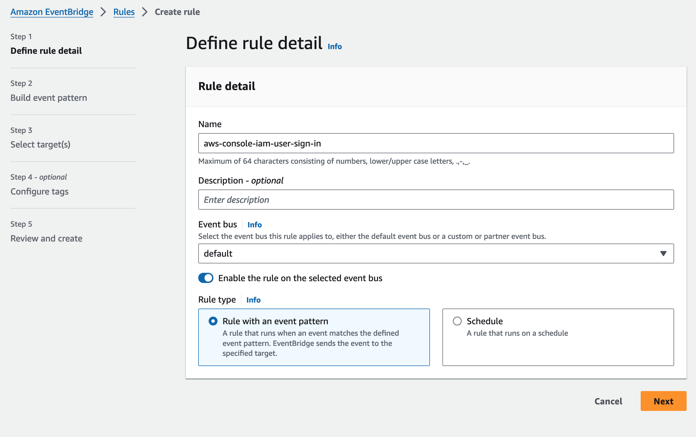
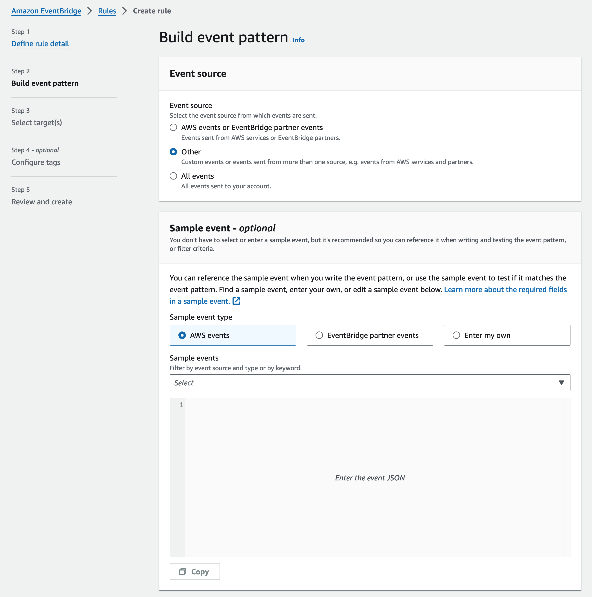
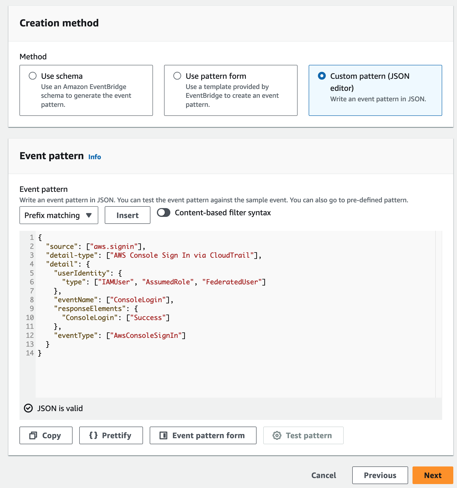
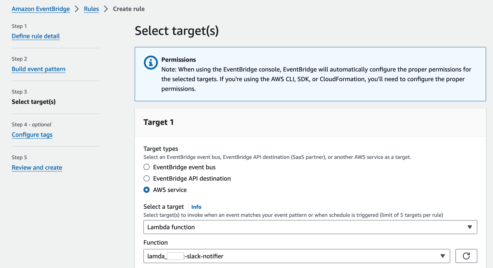
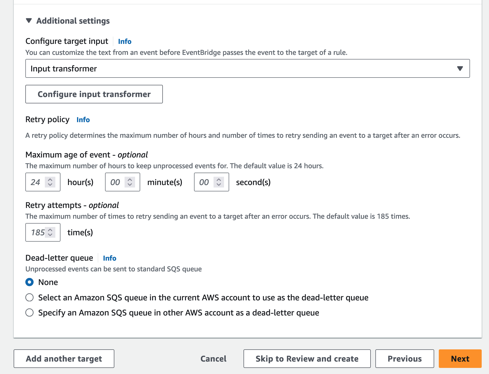
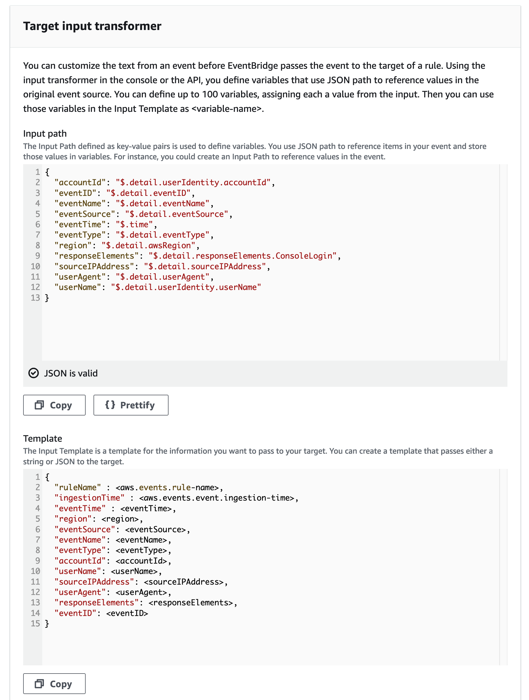
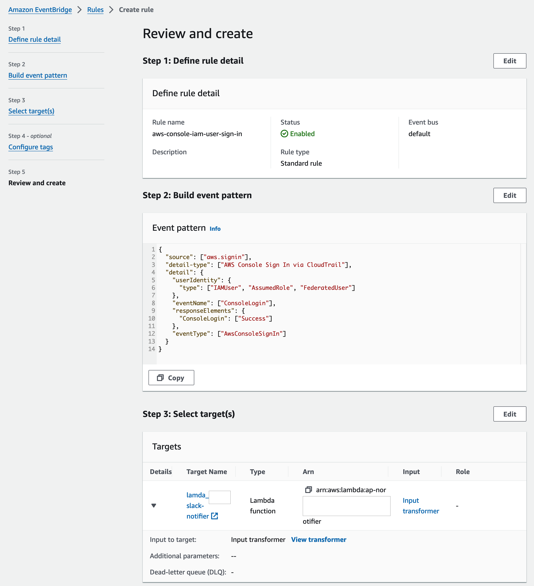

# Setup AWS CloudTrail Events Detection with EventBridge and Lambda
![Hits][hits-button]

[hits-button]: https://hits.seeyoufarm.com/api/count/incr/badge.svg?url=https%3A%2F%2Fgithub.com%2Fpassword123456%2Fsetup-aws-cloudtrail-events-detection-with-eventbridge-and-lambda&count_bg=%2379C83D&title_bg=%23555555&icon=&icon_color=%23E7E7E7&title=hits&edge_flat=false

This guide details how to define detection rules for events collected through AWS CloudTrail and detect them using AWS EventBridge. The detected events are then notified through a Lambda function and can be viewed directly in CloudTrail.

If you find this helpful, please the "star"🌟 to support further improvements.


## Limitations of This Document
- This document focuses on creating and detecting events with rules defined in EventBridge.
- The goal of using EventBridge is to simplify the detection process. This setup does not use CloudWatch or SNS services (indicating that event detection does not necessarily require CloudWatch or SNS).
- By not using CloudWatch and SNS, we reduce the number of AWS services we manage and potentially lower costs.
- There are disadvantages, such as the absence of CloudWatch features (dashboards, charts, anomaly detection metrics, CloudWatch Log Insights queries).
- For creating dashboards, charts, and conducting correlation analyses, alternative solutions to store and implement these functionalities are still required.
- If detecting and acting upon AWS events is necessary but implementing a separate event collection system is challenging (due to cost, etc.), and if immediate use of AWS-provided features is not feasible, this document may be helpful.

***

## Table of Contents
  * [1. Typical Event Detection](#1-typical-event-detection)
    - [Scenario 1](#scenario-1)
    - [Scenario 2](#scenario-2)
  * [2. Detect Event Using EventBridge](#2-detect-event-using-eventbridge)
  * [3. Create Rules in EventBridge](#3-create-rules-in-eventbridge)
  * [4. Make Detected Events Shortcut URL in CloudTrail](#4-make-detected-events-shortcut-url-in-cloudtrail)
  * [5. Let's make an Actual Rule](#5-lets-make-an-actual-rule)
  * [6. Example Lambda Code](#6-example-lambda-code)
  * [7. Do not Forget THIS](#7-do-not-forget-this)
  * [8. EventBridge Rules](#8-eventbridge-rules)
      - [8.1. aws_attached_malicious_lambda_layer](#81-aws_attached_malicious_lambda_layer)
      - [8.2. aws_cloudtrail_disable_logging](#82-aws_cloudtrail_disable_logging)
      - [8.3. aws_config_disable_recording](#83-aws_config_disable_recording)
      - [8.4. ses_delete_identity](#84-ses_delete_identity)
      - [8.5. aws_ec2_disable_encryption](#85-aws_ec2_disable_encryption)
      - [8.6. aws_ec2_startup_script_change](#86-aws_ec2_startup_script_change)
      - [8.7. aws_ec2_vm_export_failure](#87-aws_ec2_vm_export_failure)
      - [8.8. aws_ecs_task_definition_cred_endpoint_query](#88-aws_ecs_task_definition_cred_endpoint_query)
      - [8.9. aws_efs_deleted_filesystem](#89-aws_efs_deleted_filesystem)
      - [8.10. aws_eks_cluster_created_or_deleted](#810-aws_eks_cluster_created_or_deleted)
      - [8.11. aws_elasticache_security_group_created](#811-aws_elasticache_security_group_created)
      - [8.12. aws_elasticache_security_group_modified_or_deleted](#812-aws_elasticache_security_group_modified_or_deleted)
      - [8.13. aws_enum_buckets](#813-aws_enum_buckets)
      - [8.14. aws_guardduty_disruption](#814-aws_guardduty_disruption)
      - [8.15. aws_iam_backdoor_users_keys](#815-aws_iam_backdoor_users_keys)
      - [8.16. aws_passed_role_to_glue_development_endpoint](#816-aws_passed_role_to_glue_development_endpoint)
      - [8.17. aws_rds_change_master_password](#817-aws_rds_change_master_password)
      - [8.18. aws_rds_public_db_restore](#818-aws_rds_public_db_restore)
      - [8.19. aws_root_account_usage](#819-aws_root_account_usage)
      - [8.20. aws_route_53_domain_transferred_lock_disabled](#820-aws_route_53_domain_transferred_lock_disabled)
      - [8.21. aws_route_53_domain_transferred_to_another_account](#821-aws_route_53_domain_transferred_to_another_account)
      - [8.22. aws_s3_data_management_tampering](#822-aws_s3_data_management_tampering)
      - [8.23. aws_securityhub_finding_evasion](#823-aws_securityhub_finding_evasion)
      - [8.24. aws_snapshot_backup_exfiltration](#824-aws_snapshot_backup_exfiltration)
      - [8.25. aws_sts_assumerole_misuse](#825-aws_sts_assumerole_misuse)
      - [8.26. aws_sts_getsessiontoken_misuse](#826-aws_sts_getsessiontoken_misuse)
      - [8.27. aws_susp_saml_activity](#827-aws_susp_saml_activity)
      - [8.28. aws_update_login_profile](#828-aws_update_login_profile)

***

## 1. Typical Event Detection

### Scenario 1
```text
AWS Account -- (API Events) --> CloudTrail -- (Event Log) --> CloudWatch -- (Log Stream) --> Lambda ----> ElasticSearch or SIEM -- (Triggered event through Kibana, ES, Splunk) --> Action (Notify, API Call)
```

### Scenario 2
```text
AWS Account -- (API Events) --> CloudTrail -- (Event Log) --> CloudWatch -- (Event Rule) --> SNS ----> Lambda (e.g. slack)
```

## 2. Detect Event Using EventBridge
- By utilizing EventBridge, you can streamline the detection process by directly routing CloudTrail events to EventBridge. 
- This reduces the complexity and overhead associated with using additional services like CloudWatch and SNS. 
- The events are then processed by a Lambda function which can send notifications, for example, to Slack.
```text
AWS Account -- (API Events) --> CloudTrail -- (Event Log) --> EventBridge -- (Event Rule) --> Lambda (e.g. slack, API Call)
```

## 3. Create Rules in EventBridge
To create detection rules in EventBridge for detecting specific CloudTrail events, follow these steps:

1. **Open the Amazon EventBridge Console:**
   - Go to the [Amazon EventBridge Console](https://console.aws.amazon.com/events/).

2. **Create a New Rule:**
   - In the navigation pane, choose "Rules".
   - Click on the "Create rule" button.

3. **Specify Rule Details:**
   - **Name:** Enter a Rule name for the rule (e.g., `aws-console-iam-user-sign-in`).
   - **Description:** Provide a description for the rule (optional).
   - **Event bus:** `default`
   - **Rule type:** `Rule with an event pattern`
   - Click on "Next"

4. **Define the Event Pattern:**
   - Choose "Event source" and select `AWS events or EventBridge partner events`.
   - In the "AWS service" dropdown, select `CloudTrail`.
   - Define the event pattern to match specific CloudTrail events. For example, to detect console login events, use the following pattern:

     ```json
     {
       "source": ["aws.signin"],
       "detail-type": ["AWS Console Sign In via CloudTrail"],
       "detail": {
         "eventName": ["ConsoleLogin"]
       }
     }
     ```

5. **Add Targets:**
   - Click on "Next" to proceed to the "Select targets" section.
   - Choose "Lambda function" as the target type.
   - Select the Lambda function that will process the detected events (e.g., `NotifySlackFunction`).

6. **Configure Additional Settings:**
   - Configure any additional settings such as input transformation or retry policy, if needed.

7. **Review and Create:**
   - Review the details of the rule and the target.
   - Click on the "Create" button to create the rule.

Once the rule is created, EventBridge will start monitoring CloudTrail events based on the defined pattern and trigger the specified Lambda function whenever a matching event is detected.


## 4. Make Detected Events Shortcut url in CloudTrail
After detecting events, you might want to easily view the original events in CloudTrail. You can create a URL to directly access the event log in CloudTrail by combining the `eventID` and `region` from the event details.

**Example:**
- Consider the following event:
```json
{
    "eventVersion": "1.08",
    "userIdentity": {
        "type": "IAMUser",
        "principalId": "AIDAQ3EGVSNW5LMNPKYXX",
        "accountId": "013469490861",
        "userName": "john.doe"
    },
    "eventTime": "2024-09-19T23:14:40Z",
    "eventSource": "signin.amazonaws.com",
    "eventName": "ConsoleLogin",
    "awsRegion": "eu-north-1",
    "sourceIPAddress": "1.1.1.1",
    "userAgent": "Mozilla/5.0 (Macintosh; Intel Mac OS X 10.15; rv:130.0) Gecko/20100101 Firefox/130.0",
    "requestParameters": null,
    "responseElements": {
        "ConsoleLogin": "Success"
    },
    "additionalEventData": {
        "LoginTo": "https://console.aws.amazon.com/console/home?hashArgs=%23&isauthcode=true&nc2=h_ct&src=header-signin&state=hashArgsFromTB_eu-north-1_4c37e6109142ee4e",
        "MobileVersion": "No",
        "MFAUsed": "Yes"
    },
    "eventID": "deab641d-9b12-1azf-c7a9-6e91n2dd936l",
    "readOnly": false,
    "eventType": "AwsConsoleSignIn",
    "managementEvent": true
}
```
- To view this event in CloudTrail, you can construct the following URL:
```text
https://{awsRegion}.console.aws.amazon.com/cloudtrailv2/home?region={region}#/events/{eventID}
```
- For the example above, the URL would be:
```text
https://eu-north-1.console.aws.amazon.com/cloudtrailv2/home?region=eu-north-1#/events/deab641d-9b12-1azf-c7a9-6e91n2dd936l
```


## 5. Let's make an Actual Rule
- Rule that when any account except the 'root' account signs in to the AWS Console. 
- This includes the corresponding Lambda function to notify via Slack.

**Original aws console sign in event in cloudTrail:**

```
{
    "eventVersion": "1.08",
    "userIdentity": {
        "type": "IAMUser",
        "principalId": "AIDAQ3EGVSNW5LMNPKYXX",
        ...
        "accountId": "013469490861",
        "userName": "john.doe"
    },
    "eventTime": "2024-09-19T23:14:40Z",
    "eventSource": "signin.amazonaws.com",
    "eventName": "ConsoleLogin",
    "awsRegion": "eu-north-1",
    "sourceIPAddress": "1.1.1.1",
    "userAgent": "Mozilla/5.0 (Macintosh; Intel Mac OS X 10.15; rv:130.0) Gecko/20100101 Firefox/130.0",
    "requestParameters": null,
    "responseElements": {
        "ConsoleLogin": "Success"
    },
    "additionalEventData": {
        "LoginTo": "https://console.aws.amazon.com/console/home?hashArgs=%23&isauthcode=true&nc2=h_ct&src=header-signin&state=hashArgsFromTB_eu-north-1._4c37e6109142ee4e",
        "MobileVersion": "No",
        ...
        "MFAUsed": "Yes"
    },
    "eventID": "deab641d-9b12-1azf-c7a9-6e91n2dd936l",
    "readOnly": false,
    "eventType": "AwsConsoleSignIn",
    "managementEvent": true,
    ...
    }
}
```

1. **Create a New Rule:**
   - **Name:** Enter a Rule name for the rule (e.g., `aws-console-iam-user-sign-in`)
   - **Description:** `write a description for the rule (optional)`
   - **Event bus:** `default`
   - **Rule type:** `Rule with an event pattern`
   

2. **Define the Event Pattern:**
   - **Choose "Event source" and select:** `Other`
   - **Creation method:** `Custom pattern (JSON editor)`
   - **Event pattern:** `paste below`
     ```json
     {
        "source": ["aws.signin"],
        "detail-type": ["AWS Console Sign In via CloudTrail"],
        "detail": {
           "userIdentity": {
            "type": ["IAMUser", "AssumedRole", "FederatedUser"]
          },
          "eventName": ["ConsoleLogin"],
          "responseElements": {
            "ConsoleLogin": ["Success"]
           },
          "eventType": ["AwsConsoleSignIn"]
          }
     }
     ```

     
     
   - Click on "Next"

3. **Select target(s):**
   - **Target types:** `AWS service`
   - **Select a target:** `Lambda function`
   - **Function:** Select a previously created Lambda function (e.g., `slack notify`)
        
   - **Additional settings:** `Configure target input -> inputransformer`
   - **Configure input transformer:** Set Target input transformer
   - Set `Input path, Template`
     - **Input path**
        ```json
        {
          "accountId": "$.detail.userIdentity.accountId",
          "eventID": "$.detail.eventID",
          "eventName": "$.detail.eventName",
          "eventSource": "$.detail.eventSource",
          "eventTime": "$.time",
          "eventType": "$.detail.eventType",
          "region": "$.detail.awsRegion",
          "responseElements": "$.detail.responseElements.ConsoleLogin",
          "sourceIPAddress": "$.detail.sourceIPAddress",
          "userAgent": "$.detail.userAgent",
          "userName": "$.detail.userIdentity.userName"
        }
        ```
     - **Template**
         ```
         {
           "ruleName" : <aws.events.rule-name>,
           "ingestionTime" : <aws.events.event.ingestion-time>,
           "eventTime" : <eventTime>,
           "region": <region>,
           "eventSource": <eventSource>,
           "eventName": <eventName>,
           "eventType": <eventType>,
           "accountId": <accountId>,
           "userName": <userName>,
           "sourceIPAddress": <sourceIPAddress>,
           "userAgent": <userAgent>,
           "responseElements": <responseElements>,
           "eventID": <eventID>
         }
         ```
         
         
   - Click on "Confirm > Next > Next > Review Rule and Create"
     
   - Finished!


**Note:**
- For more information on input transformation and templates in EventBridge, refer to the following documentation.
- https://docs.aws.amazon.com/eventbridge/latest/userguide/eb-transform-target-input.html#eb-transform-input-predefined
- By using input transformation and templates, you can extract and parse necessary fields from the original event, and retrieve details such as the detection time and the name of the detected rule in EventBridge.

## 6. Example Lambda Code
- Sending a Message via Slack Webhook
    ```text
    import os
    import json
    import urllib3
    from datetime import datetime, timezone, timedelta
    
    http = urllib3.PoolManager()
    
    def lambda_handler(event, context):
        rule_name = event.get('ruleName', 'undefined')
        url = os.getenv('SLACK_WEBHOOK', 'undefined')
    
        region = event.get('region', 'undefined')
        event_id = event.get('eventID', 'undefined')
    
        event_url = ''
        if not region == 'undefined' and not event_id == 'undefined':
            event_url = f'https://{region}.console.aws.amazon.com/cloudtrailv2/home?region={region}#/events/{event_id}'
    
        t_zone = timezone(timedelta(hours=9))
        c_time = datetime.now(timezone.utc).astimezone(t_zone).replace(microsecond=0).isoformat()
        event_str = json.dumps(event, indent=2)
    
        if event_url:
            contents = f'\n`{rule_name}`\n\n```{event_str}```\n\n\>> {event_url}\n\>>{c_time}'
        else:
            contents = f'\n`{rule_name}`\n\n```{event_str}```\n\n\>> {c_time}'
    
        body = {
            'username': context.function_name,
            'text': contents,
            "icon_emoji": ':aws:'
        }
    
        header = {
            'User-Agent': 'slack-notifier',
            'Content-type': 'application/json'
        }
    
        response = http.request('POST', url, body=json.dumps(body).encode('utf-8'), headers=header)
        return response.status
    
    if __name__ == '__main__':
        lambda_handler(event, context)
    ```


## 7. Do not Forget THIS
- `EventBridge operates on a per-region basis. For example, if you are using both the Oregon and Seoul regions, you need to create and monitor detection rules in the EventBridge of each region.`
- If you want to send CloudTrail events to one specific region and manage detection centrally through EventBridge, you need to find way and apply.
- In most cases, AWS services are used in specific regions. To prevent access to unused regions, you can deactivate those regions or create IAM policies to restrict access to certain regions and apply them to each account.
- Even if someone tries to access another region, if no access is allowed, you won't need to analyze or detect events in that region.
- Below is an example IAM policy that restricts access to specific services and regions, considering that some services like Route53, CloudFront, IAM, and AWS WAF operate only in the global region.

**Example:**
- (IAM Policy) Restrict Available region, AWS Services
```json
{
 "Version": "2012-10-17",
 "Statement": [
     {
         "Sid": "VisualEditor0",
         "Effect": "Allow",
         "Action": "acm:*",
         "Resource": "*",
         "Condition": {
             "StringEquals": {
                 "aws:RequestedRegion": [
                     "ap-northeast-2",
                     "us-east-1"
                 ]
             }
         }
     },
     {
         "Sid": "VisualEditor1",
         "Effect": "Allow",
         "Action": "apigateway:*",
         "Resource": "*",
         "Condition": {
             "StringEquals": {
                 "aws:RequestedRegion": [
                     "ap-northeast-2",
                     "us-east-1"
                 ]
             }
         }
     },
     {
         "Sid": "VisualEditor2",
         "Effect": "Allow",
         "Action": "apigateway:*",
         "Resource": "*",
         "Condition": {
             "StringEquals": {
                 "aws:RequestedRegion": [
                     "ap-northeast-2",
                     "us-east-1"
                 ]
             }
         }
     },
     {
         "Sid": "VisualEditor3",
         "Effect": "Allow",
         "Action": "cloudfront:*",
         "Resource": "*",
         "Condition": {
             "StringEquals": {
                 "aws:RequestedRegion": [
                     "ap-northeast-2",
                     "us-east-1"
                 ]
             }
         }
     },
     {
         "Sid": "VisualEditor4",
         "Effect": "Allow",
         "Action": "ec2:*",
         "Resource": "*",
         "Condition": {
             "StringEquals": {
                 "aws:RequestedRegion": [
                     "ap-northeast-2",
                     "us-east-1"
                 ]
             }
         }
     },
     {
         "Sid": "VisualEditor5",
         "Effect": "Allow",
         "Action": "eks:*",
         "Resource": "*",
         "Condition": {
             "StringEquals": {
                 "aws:RequestedRegion": [
                     "ap-northeast-2",
                     "us-east-1"
                 ]
             }
         }
     },
     {
         "Sid": "VisualEditor6",
         "Effect": "Allow",
         "Action": "eks-auth:*",
         "Resource": "*",
         "Condition": {
             "StringEquals": {
                 "aws:RequestedRegion": [
                     "ap-northeast-2",
                     "us-east-1"
                 ]
             }
         }
     },
     {
         "Sid": "VisualEditor7",
         "Effect": "Allow",
         "Action": "elasticloadbalancing:*",
         "Resource": "*",
         "Condition": {
             "StringEquals": {
                 "aws:RequestedRegion": [
                     "ap-northeast-2",
                     "us-east-1"
                 ]
             }
         }
     },
     {
         "Sid": "VisualEditor8",
         "Effect": "Allow",
         "Action": "elasticloadbalancing:*",
         "Resource": "*",
         "Condition": {
             "StringEquals": {
                 "aws:RequestedRegion": [
                     "ap-northeast-2",
                     "us-east-1"
                 ]
             }
         }
     },
     {
         "Sid": "VisualEditor9",
         "Effect": "Allow",
         "Action": "route53:*",
         "Resource": "*",
         "Condition": {
             "StringEquals": {
                 "aws:RequestedRegion": [
                     "ap-northeast-2",
                     "us-east-1"
                 ]
             }
         }
     },
     {
         "Sid": "VisualEditor10",
         "Effect": "Allow",
         "Action": "support:*",
         "Resource": "*",
         "Condition": {
             "StringEquals": {
                 "aws:RequestedRegion": [
                     "ap-northeast-2",
                     "us-east-1"
                 ]
             }
         }
     }
 ]
}
```

## 8. EventBridge Rules
- The following rules are considered anomalous events from an information security perspective.
- Most rules were created by examining original AWS events, but some may contain errors. It is recommended to verify and use these rules.
- The detection rules include both universally applicable rules and specific (subjective perspective) rules.


#### 8.1. aws_attached_malicious_lambda_layer
- **Description:** Detects events where the configuration of a Lambda function is modified to attach a potentially malicious layer.
- **EventBridge Rule:**
    ```json
    {
      "source": [
        "aws.lambda"
      ],
      "detail-type": [
        "AWS API Call via CloudTrail"
      ],
      "detail": {
        "eventSource": [
          "lambda.amazonaws.com"
        ],
        "eventName": [
          {
            "prefix": "UpdateFunctionConfiguration"
          }
        ]
      }
    }
    ```
- **Splunk Search:**
    ```
    index=* (eventSource="lambda.amazonaws.com" AND eventName="UpdateFunctionConfiguration*")
    ```


#### 8.2. aws_cloudtrail_disable_logging
- **Description:** Detects events that disable CloudTrail logging or modify CloudTrail settings.
- **EventBridge Rule:**
    ```json
    {
      "source": [
        "aws.cloudtrail"
      ],
      "detail-type": [
        "AWS API Call via CloudTrail"
      ],
      "detail": {
        "eventSource": [
          "cloudtrail.amazonaws.com"
        ],
        "eventName": [
          "StopLogging",
          "UpdateTrail",
          "DeleteTrail"
        ]
      }
    }
    ```
- **Splunk Search:**
    ```
    index=* (eventSource="cloudtrail.amazonaws.com" AND (eventName="StopLogging" OR eventName="UpdateTrail" OR eventName="DeleteTrail"))
    ```

#### 8.3. aws_config_disable_recording
- **Description:** Detects events that disable AWS Config's resource change recording and compliance monitoring.
- **EventBridge Rule:**
    ```json
    {
      "source": [
        "aws.config"
      ],
      "detail-type": [
        "AWS API Call via CloudTrail"
      ],
      "detail": {
        "eventSource": [
          "config.amazonaws.com"
        ],
        "eventName": [
          "DeleteDeliveryChannel",
          "StopConfigurationRecorder"
        ]
      }
    }
    ```
- **Splunk Search:**
    ```
    index=* (eventSource="config.amazonaws.com" AND (eventName="DeleteDeliveryChannel" OR eventName="StopConfigurationRecorder"))
    ```

#### 8.4. ses_delete_identity
- **Description:** Detects events where an email identity (domain or email address) is deleted in AWS Simple Email Service (SES).
- **EventBridge Rule:**
    ```json
    {
      "source": [
        "aws.ses"
      ],
      "detail-type": [
        "AWS API Call via CloudTrail"
      ],
      "detail": {
        "eventSource": [
          "ses.amazonaws.com"
        ],
        "eventName": [
          "DeleteIdentity"
        ]
      }
    }
    ```
- **Splunk Search:**
    ```
    index=* (eventSource="ses.amazonaws.com" AND eventName="DeleteIdentity")
    ```
  
#### 8.5. aws_ec2_disable_encryption
- **Description:** Detects events that disable default EBS (Elastic Block Store) encryption on an EC2 instance.
- **EventBridge Rule:**
    ```json
    {
      "source": [
        "aws.ec2"
      ],
      "detail-type": [
        "AWS API Call via CloudTrail"
      ],
      "detail": {
        "eventSource": [
          "ec2.amazonaws.com"
        ],
        "eventName": [
          "DisableEbsEncryptionByDefault"
        ]
      }
    }
    ```
- **Splunk Search:**
    ```
    index=* (eventSource="ec2.amazonaws.com" AND eventName="DisableEbsEncryptionByDefault")
    ```

#### 8.6. aws_ec2_startup_script_change
- **Description:** Detects events where the startup script (userData) of an EC2 instance is changed.
- **EventBridge Rule:**
    ```json
    {
      "source": [
        "aws.ec2"
      ],
      "detail-type": [
        "AWS API Call via CloudTrail"
      ],
      "detail": {
        "eventSource": [
          "ec2.amazonaws.com"
        ],
        "eventName": [
          "ModifyInstanceAttribute"
        ],
        "requestParameters": {
          "attribute": [
            "userData"
          ]
        }
      }
    }
    ```
- **Splunk Search:**
    ```
    index=* (eventSource="ec2.amazonaws.com" AND requestParameters.attribute="userData" AND eventName="ModifyInstanceAttribute")
    ```

#### 8.7. aws_ec2_vm_export_failure
- **Description:** Detects events where an attempt to export an EC2 instance fails.
- **EventBridge Rule:**
    ```json
    {
      "source": [
        "aws.ec2"
      ],
      "detail-type": [
        "AWS API Call via CloudTrail"
      ],
      "detail": {
        "eventSource": [
          "ec2.amazonaws.com"
        ],
        "eventName": [
          "CreateInstanceExportTask"
        ],
        "errorCode": [
          {
            "exists": false
          }
        ],
        "errorMessage": [
          {
            "exists": false
          }
        ],
        "responseElements": [
          {
            "prefix": "Failure",
            "exists": false
          }
        ]
      }
    }
    ```
- **Splunk Search:**
    ```
    index=* ((eventName="CreateInstanceExportTask" AND eventSource="ec2.amazonaws.com") AND NOT (errorMessage="" OR errorCode="" OR responseElements="Failure"))
    ```

#### 8.8. aws_ecs_task_definition_cred_endpoint_query
- **Description:** Detects commands in an ECS task definition that query the AWS credentials endpoint `($AWS_CONTAINER_CREDENTIALS_RELATIVE_URI)`.
- **EventBridge Rule:**
    ```json
    {
      "source": [
        "aws.ecs"
      ],
      "detail-type": [
        "AWS API Call via CloudTrail"
      ],
      "detail": {
        "eventSource": [
          "ecs.amazonaws.com"
        ],
        "eventName": [
          "DescribeTaskDefinition",
          "RegisterTaskDefinition",
          "RunTask"
        ],
        "requestParameters": {
          "containerDefinitions": {
            "command": [
              {
                "contains": "$AWS_CONTAINER_CREDENTIALS_RELATIVE_URI"
              }
            ]
          }
        }
      }
    }
    ```
- **Splunk Search:**
    ```
    index=* (eventSource="ecs.amazonaws.com" AND (eventName="DescribeTaskDefinition" OR eventName="RegisterTaskDefinition" OR eventName="RunTask") AND requestParameters.containerDefinitions.command="$AWS_CONTAINER_CREDENTIALS_RELATIVE_URI")
    ```

#### 8.9. aws_efs_deleted_filesystem
- **Description:** Detects events where an Elastic File System (EFS) is deleted.
- **EventBridge Rule:**
    ```json
    {
      "source": [
        "aws.elasticfilesystem"
      ],
      "detail-type": [
        "AWS API Call via CloudTrail"
      ],
      "detail": {
        "eventSource": [
          "elasticfilesystem.amazonaws.com"
        ],
        "eventName": [
          "DeleteFileSystem"
        ]
      }
    }
    ```
- **Splunk Search:**
    ```
    index=* (eventSource="elasticfilesystem.amazonaws.com" AND eventName="DeleteFileSystem")
    ```
  
#### 8.10. aws_eks_cluster_created_or_deleted
- **Description:** Detects events where an Elastic Kubernetes Service (EKS) cluster is created or deleted.
- **EventBridge Rule:**
    ```json
    {
      "source": [
        "aws.eks"
      ],
      "detail-type": [
        "AWS API Call via CloudTrail"
      ],
      "detail": {
        "eventSource": [
          "eks.amazonaws.com"
        ],
        "eventName": [
          "CreateCluster",
          "DeleteCluster"
        ]
      }
    }
    ```
- **Splunk Search:**
    ```
    index=* (eventSource="eks.amazonaws.com" AND (eventName="CreateCluster" OR eventName="DeleteCluster"))
    ```
  
#### 8.11. aws_elasticache_security_group_created
- **Description:** Detects events where a new ElastiCache security group is created.
- **EventBridge Rule:**
    ```json
    {
      "source": [
        "aws.elasticache"
      ],
      "detail-type": [
        "AWS API Call via CloudTrail"
      ],
      "detail": {
        "eventSource": [
          "elasticache.amazonaws.com"
        ],
        "eventName": [
          "CreateCacheSecurityGroup"
        ]
      }
    }
    ```
- **Splunk Search:**
    ```
    index=* (eventSource="elasticache.amazonaws.com" AND eventName="CreateCacheSecurityGroup")
    ```
  
#### 8.12. aws_elasticache_security_group_modified_or_deleted
- **Description:** Detects events where an ElastiCache security group is modified or deleted.
- **EventBridge Rule:**
    ```json
    {
      "source": [
        "aws.elasticache"
      ],
      "detail-type": [
        "AWS API Call via CloudTrail"
      ],
      "detail": {
        "eventSource": [
          "elasticache.amazonaws.com"
        ],
        "eventName": [
          "DeleteCacheSecurityGroup",
          "AuthorizeCacheSecurityGroupIngress",
          "RevokeCacheSecurityGroupIngress",
          "AuthorizeCacheSecurityGroupEgress",
          "RevokeCacheSecurityGroupEgress"
        ]
      }
    }
    ```
- **Splunk Search:**
    ```
    index=* (eventSource="elasticache.amazonaws.com" AND (eventName="DeleteCacheSecurityGroup" OR eventName="AuthorizeCacheSecurityGroupIngress" OR eventName="RevokeCacheSecurityGroupIngress" OR eventName="AuthorizeCacheSecurityGroupEgress" OR eventName="RevokeCacheSecurityGroupEgress"))
    ```
  
#### 8.13. aws_enum_buckets
- **Description:** Detects attempts to list S3 buckets, excluding those made by assumed roles.
- **EventBridge Rule:**
    ```json
    {
      "source": [
        "aws.s3"
      ],
      "detail-type": [
        "AWS API Call via CloudTrail"
      ],
      "detail": {
        "eventSource": [
          "s3.amazonaws.com"
        ],
        "eventName": [
          "ListBuckets"
        ],
        "userIdentity": {
          "type": [
            {
              "anything-but": "AssumedRole"
            }
          ]
        }
      }
    }
    ```
- **Splunk Search:**
    ```
    index=* ((eventSource="s3.amazonaws.com" AND eventName="ListBuckets") AND NOT type="AssumedRole")
    ```
  
#### 8.14. aws_guardduty_disruption
- **Description:** Detects events where a new IPSet is created in GuardDuty.
- **EventBridge Rule:**
    ```json
    {
      "source": [
        "aws.guardduty"
      ],
      "detail-type": [
        "AWS API Call via CloudTrail"
      ],
      "detail": {
        "eventSource": [
          "guardduty.amazonaws.com"
        ],
        "eventName": [
          "CreateIPSet"
        ]
      }
    }
    ```
- **Splunk Search:**
    ```
    index=* (eventSource="guardduty.amazonaws.com" AND eventName="CreateIPSet")
    ```
  
#### 8.15. aws_iam_backdoor_users_keys
- **Description:** Detects suspicious attempts to create access keys for IAM users that could indicate backdoor access.
- **EventBridge Rule:**
    ```json
    {
      "source": [
        "aws.iam"
      ],
      "detail-type": [
        "AWS API Call via CloudTrail"
      ],
      "detail": {
        "eventSource": [
          "iam.amazonaws.com"
        ],
        "eventName": [
          "CreateAccessKey"
        ],
        "userIdentity": {
          "arn": [
            {
              "anything-but": {
                "prefix": "responseElements.accessKey.userName"
              }
            }
          ]
        }
      }
    }
    ```
- **Splunk Search:**
    ```
    index=* ((eventSource="iam.amazonaws.com" AND eventName="CreateAccessKey") AND NOT userIdentity.arn="responseElements.accessKey.userName") | table userIdentity.arn,responseElements.accessKey.userName,errorCode,errorMessage
    ```

#### 8.16. aws_passed_role_to_glue_development_endpoint
- **Description:** Detects events where AWS Glue development endpoints are created, deleted, or updated.
- **EventBridge Rule:**
    ```json
    {
      "source": [
        "aws.glue"
      ],
      "detail-type": [
        "AWS API Call via CloudTrail"
      ],
      "detail": {
        "eventSource": [
          "glue.amazonaws.com"
        ],
        "eventName": [
          "CreateDevEndpoint",
          "DeleteDevEndpoint",
          "UpdateDevEndpoint"
        ]
      }
    }
    ```
- **Splunk Search:**
    ```
    index=* (eventSource="glue.amazonaws.com" AND (eventName="CreateDevEndpoint" OR eventName="DeleteDevEndpoint" OR eventName="UpdateDevEndpoint"))
    ```

#### 8.17. aws_rds_change_master_password
- **Description:** Detects events where the master user password of an RDS instance is changed.
- **EventBridge Rule:**
    ```json
    {
      "source": [
        "aws.rds"
      ],
      "detail-type": [
        "AWS API Call via CloudTrail"
      ],
      "detail": {
        "eventSource": [
          "rds.amazonaws.com"
        ],
        "eventName": [
          "ModifyDBInstance"
        ],
        "responseElements": {
          "pendingModifiedValues": {
            "masterUserPassword": [
              {
                "exists": true
              }
            ]
          }
        }
      }
    }
    ```
- **Splunk Search:**
    ```
    index=* (eventSource="rds.amazonaws.com" AND responseElements.pendingModifiedValues.masterUserPassword="***" AND eventName="ModifyDBInstance")
    ```
  
#### 8.18. aws_rds_public_db_restore
- **Description:** Detects events where an RDS instance with public access is restored from a snapshot.
- **EventBridge Rule:**
    ```json
    {
      "source": [
        "aws.rds"
      ],
      "detail-type": [
        "AWS API Call via CloudTrail"
      ],
      "detail": {
        "eventSource": [
          "rds.amazonaws.com"
        ],
        "eventName": [
          "RestoreDBInstanceFromDBSnapshot"
        ],
        "responseElements": {
          "publiclyAccessible": [
            "true"
          ]
        }
      }
    }
    ```
- **Splunk Search:**
    ```
    index=* (eventSource="rds.amazonaws.com" AND responseElements.publiclyAccessible="true" AND eventName="RestoreDBInstanceFromDBSnapshot")
    ```
  
#### 8.19. aws_root_account_usage
- **Description:** Detects events where the root account makes AWS service calls, excluding internal AWS service calls.
- **EventBridge Rule:**
    ```json
    {
      "source": [
        "aws.cloudtrail"
      ],
      "detail-type": [
        "AWS API Call via CloudTrail"
      ],
      "detail": {
        "userIdentity": {
          "type": [
            "Root"
          ]
        },
        "eventType": [
          {
            "anything-but": "AwsServiceEvent"
          }
        ]
      }
    }
    ```
- **Splunk Search:**
    ```
    index=* (userIdentity.type="Root" AND NOT eventType="AwsServiceEvent")
    ```
  
#### 8.20. aws_route_53_domain_transferred_lock_disabled
- **Description:** Detects events where the transfer lock of a Route 53 domain is disabled.
- **EventBridge Rule:**
    ```json
    {
      "source": [
        "aws.route53"
      ],
      "detail-type": [
        "AWS API Call via CloudTrail"
      ],
      "detail": {
        "eventSource": [
          "route53.amazonaws.com"
        ],
        "eventName": [
          "DisableDomainTransferLock"
        ]
      }
    }
    ```
- **Splunk Search:**
    ```
    index=* (eventSource="route53.amazonaws.com" AND eventName="DisableDomainTransferLock")
    ```

#### 8.21. aws_route_53_domain_transferred_to_another_account
- **Description:** Detects events where a Route 53 domain is transferred to another AWS account.
- **EventBridge Rule:**
    ```json
    {
      "source": [
        "aws.route53"
      ],
      "detail-type": [
        "AWS API Call via CloudTrail"
      ],
      "detail": {
        "eventSource": [
          "route53.amazonaws.com"
        ],
        "eventName": [
          "TransferDomainToAnotherAwsAccount"
        ]
      }
    }
    ```
- **Splunk Search:**
    ```
    index=* (eventSource="route53.amazonaws.com" AND eventName="TransferDomainToAnotherAwsAccount")
    ```

#### 8.22. aws_s3_data_management_tampering
- **Description:** Detects events related to tampering with S3 bucket data management settings or objects.
- **EventBridge Rule:**
    ```json
    {
      "source": [
        "aws.s3"
      ],
      "detail-type": [
        "AWS API Call via CloudTrail"
      ],
      "detail": {
        "eventSource": [
          "s3.amazonaws.com"
        ],
        "eventName": [
          "PutBucketLogging",
          "PutBucketWebsite",
          "PutEncryptionConfiguration",
          "PutLifecycleConfiguration",
          "PutReplicationConfiguration",
          "ReplicateObject",
          "RestoreObject"
        ]
      }
    }
    ```
- **Splunk Search:**
    ```
    index=* (eventSource="s3.amazonaws.com" AND (eventName="PutBucketLogging" OR eventName="PutBucketWebsite" OR eventName="PutEncryptionConfiguration" OR eventName="PutLifecycleConfiguration" OR eventName="PutReplicationConfiguration" OR eventName="ReplicateObject" OR eventName="RestoreObject"))
    ```

#### 8.23. aws_securityhub_finding_evasion
- **Description:** Detects events that modify, delete, or update findings in AWS Security Hub.
- **EventBridge Rule:**
    ```json
    {
      "source": [
        "aws.securityhub"
      ],
      "detail-type": [
        "AWS API Call via CloudTrail"
      ],
      "detail": {
        "eventSource": [
          "securityhub.amazonaws.com"
        ],
        "eventName": [
          "BatchUpdateFindings",
          "DeleteInsight",
          "UpdateFindings",
          "UpdateInsight"
        ]
      }
    }
    ```
- **Splunk Search:**
    ```
    index=* (eventSource="securityhub.amazonaws.com" AND (eventName="BatchUpdateFindings" OR eventName="DeleteInsight" OR eventName="UpdateFindings" OR eventName="UpdateInsight")) | table sourceIPAddress,userIdentity.arn
    ```
  
#### 8.24. aws_snapshot_backup_exfiltration
- **Description:** Detects events that modify the properties of EC2 snapshots.
- **EventBridge Rule:**
    ```json
    {
      "source": [
        "aws.ec2"
      ],
      "detail-type": [
        "AWS API Call via CloudTrail"
      ],
      "detail": {
        "eventSource": [
          "ec2.amazonaws.com"
        ],
        "eventName": [
          "ModifySnapshotAttribute"
        ]
      }
    }
    ```
- **Splunk Search:**
    ```
    index=* (eventSource="ec2.amazonaws.com" AND eventName="ModifySnapshotAttribute")
    ```
  
#### 8.25. aws_sts_assumerole_misuse
- **Description:** Detects user activities involving role assumption through AWS Security Token Service (STS).
- **EventBridge Rule:**
    ```json
    {
      "source": [
        "aws.sts"
      ],
      "detail-type": [
        "AWS API Call via CloudTrail"
      ],
      "detail": {
        "userIdentity": {
          "type": [
            "AssumedRole"
          ],
          "sessionContext": {
            "sessionIssuer": {
              "type": [
                "Role"
              ]
            }
          }
        }
      }
    }
    ```
- **Splunk Search:**
    ```
    index=* (userIdentity.type="AssumedRole" AND userIdentity.sessionContext.sessionIssuer.type="Role")
    ```
  
#### 8.26. aws_sts_getsessiontoken_misuse
- **Description:** Detects events where an IAM user requests a session token from STS.
- **EventBridge Rule:**
    ```json
    {
      "source": [
        "aws.sts"
      ],
      "detail-type": [
        "AWS API Call via CloudTrail"
      ],
      "detail": {
        "eventSource": [
          "sts.amazonaws.com"
        ],
        "eventName": [
          "GetSessionToken"
        ],
        "userIdentity": {
          "type": [
            "IAMUser"
          ]
        }
      }
    }
    ```
- **Splunk Search:**
    ```
    index=* (eventSource="sts.amazonaws.com" AND eventName="GetSessionToken" AND userIdentity.type="IAMUser")
    ```
  
#### 8.27. aws_susp_saml_activity
- **Description:** Detects API calls related to SAML-based authentication to monitor for suspicious activity.
- **EventBridge Rule:**
    ```json
    {
      "source": [
        "aws.sts",
        "aws.iam"
      ],
      "detail-type": [
        "AWS API Call via CloudTrail"
      ],
      "detail": {
        "eventSource": [
          {
            "anything": [
              "sts.amazonaws.com",
              "iam.amazonaws.com"
            ]
          }
        ],
        "eventName": [
          {
            "anything": [
              "AssumeRoleWithSAML",
              "UpdateSAMLProvider"
            ]
          }
        ]
      }
    }
    ```
- **Splunk Search:**
    ```
    index=* ((eventSource="sts.amazonaws.com" AND eventName="AssumeRoleWithSAML") OR (eventSource="iam.amazonaws.com" AND eventName="UpdateSAMLProvider"))
    ```
  
#### 8.28. aws_update_login_profile
- **Description:** Detects events that update the login profile of an IAM user, especially when the requesting user is different from the updated user.
- **EventBridge Rule:**
    ```json
    {
      "source": [
        "aws.iam"
      ],
      "detail-type": [
        "AWS API Call via CloudTrail"
      ],
      "detail": {
        "eventSource": [
          "iam.amazonaws.com"
        ],
        "eventName": [
          "UpdateLoginProfile"
        ],
        "userIdentity": {
          "arn": [
            {
              "anything-but": {
                "prefix": "requestParameters.userName"
              }
            }
          ]
        }
      }
    }
    ```
- **Splunk Search:**
    ```
    index=* ((eventSource="iam.amazonaws.com" AND eventName="UpdateLoginProfile") AND NOT userIdentity.arn="requestParameters.userName") | table userIdentity.arn,requestParameters.userName,errorCode,errorMessage
    ```

---
### Read Next
- [Simple API Access Key issuer, Validate aes-gcm-256](https://github.com/password123456/access-key-issuer-validator-aes-gcm)
